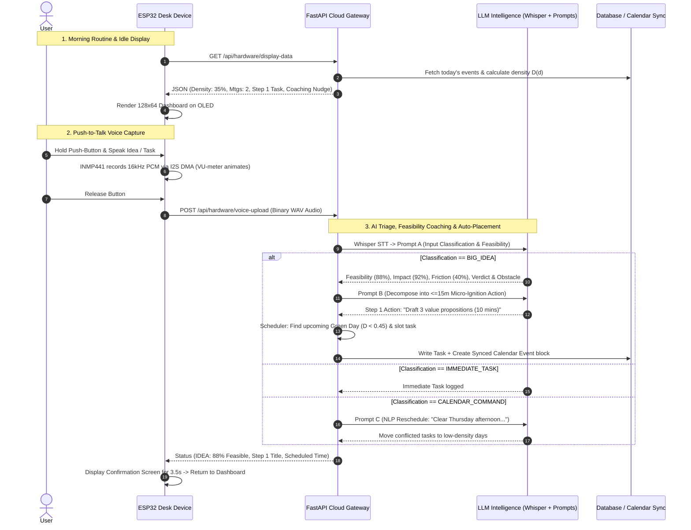

# CoachPilot AI (My Buddy) — ESP32 Physical AI Desk Companion & Productivity Engine

**CoachPilot AI** is a physical hardware desk assistant powered by the **ESP32** microcontroller, an **INMP441 I2S digital microphone**, and an **SSD1306 OLED display**. It syncs bi-directionally with your Google and Apple calendars, captures unfiltered voice notes, evaluates the feasibility of big ideas, generates frictionless $\le 15$-minute micro-ignition tasks, and automatically schedules them into low-density calendar slots.

---

## 🌟 End-to-End System Architecture

```
 ┌─────────────────────────────────────────────────────────┐
 │               PHYSICAL DESK COMPANION (ESP32)           │
 │                                                         │
 │  ┌────────────────┐   ┌────────────────┐   ┌─────────┐  │
 │  │ 0.96" I2C OLED │   │ INMP441 I2S Mic│   │ Push-To-│  │
 │  │  (128x64 Pix)  │   │  (16kHz/16-bit)│   │  Talk   │  │
 │  └───────▲────────┘   └───────▲────────┘   └───▲─────┘  │
 │          │ (I2C)              │ (I2S DMA)      │ (GPIO) │
 │  ┌───────┴────────────────────┴────────────────┴──────┐ │
 │  │             ESP32-S3 / ESP32-WROOM-32              │ │
 │  └────────────────────────────┬───────────────────────┘ │
 └───────────────────────────────┼─────────────────────────┘
                                 │ Wi-Fi (HTTPS REST / JSON)
                                 ▼
 ┌─────────────────────────────────────────────────────────┐
 │       24/7 CLOUD-HOSTED BACKEND (No Laptop Needed)      │
 │                                                         │
 │  ┌──────────────────┐  ┌─────────────────────────────┐  │
 │  │  FastAPI Backend │  │   Supabase / SQLite DB      │  │
 │  └────────▲─────────┘  └──────────────▲──────────────┘  │
 │           │                           │                 │
 │  ┌────────┴─────────┐  ┌──────────────┴──────────────┐  │
 │  │ Whisper STT API  │  │ Google / Apple Calendar API │  │
 │  │ Gemini / GPT-4o  │  │ (Bi-directional Sync)       │  │
 │  └──────────────────┘  └─────────────────────────────┘  │
 └─────────────────────────────────────────────────────────┘
```

---

## 🔄 Complete End-to-End Workflow



### The 5 Core Product Steps in Detail

1. **Morning Cognitive Synthesis**: When idle on your desk, the OLED display continuously shows your daily cognitive load score ($D \in [0, 100\%]$), your scheduled meeting count, your highest-priority **Step 1 Ignition Task**, and an executive coaching ticker.
2. **Frictionless Voice Capture**: Press and hold the physical button to record any unfiltered thought. The ESP32 captures uncompressed 16 kHz 16-bit mono audio with live waveform VU animations.
3. **Idea Feasibility & Reality Check (Prompt A)**: The cloud backend feeds audio to Whisper and Prompt A. For big ideas, it scores venture feasibility (1-100), impact potential, and identifies the core emotional or technical friction causing procrastination.
4. **Behavioral Step Decomposition (Prompt B)**: Ambitious ideas are broken down into 3–5 progressive steps, strictly enforcing that **Step 1 is a $\le 15$-minute Micro-Ignition Action** (zero setup friction to eliminate task paralysis).
5. **Cognitive Schedule Density Engine & Auto-Placement (Prompt C)**: The system analyzes your calendar load over the next 7 days and automatically books your micro starter task into an open focus window on the earliest **Green Focus Day** ($D < 0.45$), syncing directly to your Google and Apple Calendars.

---

## 📐 Schedule Density Mathematical Model

For any given date $d$, the **Schedule Density Score** $D(d)$ is calculated as:

$$D(d) = \min\left(1.0, \frac{\sum_{i=1}^{N} (T_{i} \times W_{i}) + (N \times C_{\text{switch}})}{T_{\text{work\_window}}}\right)$$

### Parameters & Cognitive Weights:
- $T_i$: Duration of calendar event $i$ in minutes.
- $W_i$: Cognitive fatigue weight:
  - High-stakes client meetings / Architecture reviews: **$1.5\times$**
  - Standard team syncs / 1-on-1s: **$1.0\times$**
  - Light webinars / passive info sessions: **$0.6\times$**
  - Deep focus blocks: **$1.2\times$**
- $N$: Total number of distinct scheduled appointments on day $d$.
- $C_{\text{switch}}$: **15-minute Context-Switching Penalty** added per meeting transition.
- $T_{\text{work\_window}}$: Total working minutes in the day (**$540\text{ minutes} = 9\text{ hours}$**).

### Schedule Density Tiers:
| Tier | Score Range | Status | Auto-Scheduling Behavior |
| :--- | :--- | :--- | :--- |
| 🟢 **Green (Light)** | $0.00 \le D < 0.45$ | High cognitive bandwidth | **Primary target for Deep Work ($>45$m) & Idea Ignition Steps** |
| 🟡 **Yellow (Moderate)**| $0.45 \le D < 0.70$ | Balanced schedule | Target for quick 15-minute administrative micro-tasks |
| 🟠 **Orange (Dense)** | $0.70 \le D < 0.85$ | High fatigue risk | Protected buffers; no new automated tasks scheduled |
| 🔴 **Red (Overloaded)** | $D \ge 0.85$ | Burnout zone | Proactively prompts user to float non-essential tasks |

---

## 🛠️ Hardware Bill of Materials (BOM)

| Component | Recommended Model | Purpose | Est. Cost |
| :--- | :--- | :--- | :--- |
| **MCU** | **ESP32-S3-DevKitC-1** (or ESP32-WROOM-32) | Dual-core 240MHz, I2S DMA, Wi-Fi networking | \$3.50 – \$5.00 |
| **Display** | **0.96" or 1.3" I2C OLED (SSD1306)** | 128x64 graphic screen for daily synthesis | \$2.00 – \$3.00 |
| **Microphone** | **INMP441 I2S Omnidirectional Mic** | 24-bit digital audio capture with high SNR | \$1.20 – \$2.00 |
| **Button** | **12x12mm Tactile Push Button** | Push-to-Talk actuation switch | \$0.20 |
| **Status LED** | **3mm / 5mm Blue or RGB LED** | Recording / upload indicator | \$0.10 |
| **Resistor** | **220Ω 1/4W Resistor** | Current limiter for status LED | \$0.05 |
| **Power** | **USB-C Cable + 5V/1A Wall Adapter** | Continuous desk power (or 3.7V LiPo battery) | \$2.00 |
| **Total BOM** | | | **\$9.00 – \$12.00** |

---

## 🔌 Circuit Schematic & Wiring Pinout

```
   ┌────────────────────────────────────────────────────────┐
   │                       ESP32 PINOUT                     │
   │                                                        │
   │   [3.3V]  ────────────┬─────────────┬────────────┐     │
   │   [GND]   ─────────┐  │ (3.3V)      │ (3.3V)     │     │
   │                    │  │             │            │     │
   │   [GPIO 21] ───────┼──┼── SDA       │            │     │
   │   [GPIO 22] ───────┼──┼── SCL       │            │     │
   │                    │  │  (OLED)     │            │     │
   │                    │  │             │            │     │
   │   [GPIO 33] ───────┼──┼─────────────┼── SCK      │     │
   │   [GPIO 25] ───────┼──┼─────────────┼── WS       │     │
   │   [GPIO 32] ───────┼──┼─────────────┼── SD       │     │
   │                    │  │             │  (INMP441) │     │
   │                    │  └─────────────┴── VDD      │     │
   │                    └──┬─────────────┬── GND/L/R  │     │
   │                       │             │            │     │
   │   [GPIO 4]  ──────────┼── Push BTN ─┘            │     │
   │   [GPIO 2]  ──[220Ω]──┼── Status LED ────────────┘     │
   └───────────────────────┴────────────────────────────────┘
```

### Complete Pin Assignment Table

| Module | Pin | ESP32 Pin | Logic Level | Description |
| :--- | :--- | :--- | :--- | :--- |
| **SSD1306 OLED (128x64)** | **VCC** | **3V3** | 3.3V | Display Power |
| | **GND** | **GND** | 0V | Ground |
| | **SDA** | **GPIO 21** | 3.3V | Hardware I2C SDA |
| | **SCL** | **GPIO 22** | 3.3V | Hardware I2C SCL |
| **INMP441 I2S Mic** | **VDD** | **3V3** | 3.3V | Digital Mic Power |
| | **GND** | **GND** | 0V | Ground |
| | **L/R** | **GND** | 0V | Left Channel Select |
| | **SD** | **GPIO 32** | 3.3V | I2S Serial Data Out |
| | **WS** | **GPIO 25** | 3.3V | I2S Word Select / LR Clock |
| | **SCK** | **GPIO 33** | 3.3V | I2S Bit Clock |
| **Push-to-Talk Button** | **Pin 1** | **GPIO 4** | Active LOW | Input Pull-up (`INPUT_PULLUP`) |
| | **Pin 2** | **GND** | 0V | Ground |
| **Status LED** | **Anode (+)** | **GPIO 2** | 3.3V (220Ω) | HIGH when recording |
| | **Cathode (-)**| **GND** | 0V | Ground |

---

## 💻 OLED Visual UI Layouts

```
1. Idle Dashboard                  2. Recording State (Held)        3. AI Coaching Result
+--------------------------------+ +--------------------------------+ +--------------------------------+
| Mon Sep 01          LIGHT [35%]| |        >> RECORDING <<         | | STATUS: IDEA (88% Feasible)    |
|--------------------------------| |                                | |--------------------------------|
| [ 35% ]  Mtgs: 2               | |     |||| | | |||||| | |||      | | Starter Action:                |
| [LOAD ]  Step 1 (Micro):       | |                                | | Draft 3 value propositions     |
|          Draft 3 value ...     | |    Speak thought / idea...     | |--------------------------------|
|--------------------------------| +--------------------------------+ | Feasibility: 88%               |
| GREEN DAY: Launch ideas!       |                                    +--------------------------------+
+--------------------------------+
```

---

## ⚡ Flashing the ESP32 Firmware

1. Open [`hardware/esp32/CoachPilot_ESP32.ino`](hardware/esp32/CoachPilot_ESP32.ino) in **Arduino IDE** or **VS Code PlatformIO**.
2. Install the required libraries in Arduino IDE (*Sketch $\rightarrow$ Include Library $\rightarrow$ Manage Libraries*):
   - `Adafruit SSD1306`
   - `Adafruit GFX Library`
   - `ArduinoJson` (v7)
3. Set your Wi-Fi credentials and cloud server URL:
   ```cpp
   const char* WIFI_SSID = "YOUR_WIFI_SSID";
   const char* WIFI_PASS = "YOUR_WIFI_PASSWORD";
   const char* SERVER_BASE = "https://your-backend-app.onrender.com"; // or local IP http://192.168.x.x:8000
   ```
4. Connect the ESP32 board via USB, select **ESP32-S3 Dev Module** (or **ESP32 Dev Module**), and click **Upload**.

---

## ☁️ 24/7 Cloud Backend Deployment (No Laptop Needed)

Deploy the backend to **Render.com** (or Fly.io / Railway) for free in 3 minutes so your ESP32 companion works 24/7 independently:

1. Log in to [Render.com](https://render.com/) and click **New + $\rightarrow$ Web Service**.
2. Connect your GitHub repository (`anaswarramesh/my_buddy`).
3. Configure:
   - **Environment:** `Python`
   - **Build Command:** `pip install -r backend/requirements.txt`
   - **Start Command:** `uvicorn app.main:app --host 0.0.0.0 --port $PORT`
4. Add your API Keys in **Environment Variables**:
   - `OPENAI_API_KEY`: `your_openai_key`
   - `GEMINI_API_KEY`: `your_gemini_key`
   - `LLM_PROVIDER`: `gemini` (or `openai`)
5. Copy your live Render URL (e.g., `https://coachpilot-backend.onrender.com`) and paste it into `SERVER_BASE` in the ESP32 firmware.

---

## 💬 Conversational NLP Rescheduling Examples

You can speak or type dynamic natural language calendar commands anytime:

- *"Clear my Thursday afternoon and float those tasks to next week."*
- *"Free up Friday morning for deep focus."*
- *"Move my 2 PM design review to tomorrow morning."*
- *"Schedule a 45-minute deep focus block on my next Green Day."*

The backend's **Prompt C** will automatically inspect the 7-day density forecast, calculate conflict-free windows, update tasks, and write the new schedule to Google Calendar.

---

## 📱 Cross-Platform Mobile Client (React Native / Expo)

In addition to your physical ESP32 desk companion, CoachPilot includes a mobile companion app for iOS & Android:

```bash
cd frontend
npm install
npx expo start
```
- Inspect your **Idea Backlog** and feasibility radar scores.
- View your **7-Day Rolling Density Forecast**.
- Tap **Auto-Schedule** on any starter step or manual task.

---

## 🔌 Connecting Google Calendar & Apple Calendar

### 1. Google Calendar (OAuth 2.0)
1. Go to [Google Cloud Console](https://console.cloud.google.com/) and enable the **Google Calendar API**.
2. Create **OAuth 2.0 Client Credentials** (Web Application).
3. Set Redirect URI to `https://your-domain.com/api/calendar/google/callback`.
4. Add to `backend/.env`:
   ```env
   GOOGLE_CLIENT_ID=your_google_client_id
   GOOGLE_CLIENT_SECRET=your_google_client_secret
   ```

### 2. Apple Calendar (CalDAV)
1. Generate an **App-Specific Password** at [appleid.apple.com](https://appleid.apple.com/).
2. Add to `backend/.env`:
   ```env
   CALDAV_URL=https://caldav.icloud.com
   CALDAV_USERNAME=your_apple_id@icloud.com
   CALDAV_PASSWORD=your_app_specific_password
   ```

---

## 🧪 Local Backend Testing & Web Preview

Run the automated test suite locally:
```bash
cd backend
PYTHONPATH=. .venv/bin/pytest -v
```

Launch the interactive local web dashboard:
```bash
cd backend
source .venv/bin/activate
uvicorn app.main:app --host 0.0.0.0 --port 8000 --reload
```
Open **`http://localhost:8000`** in your browser.
