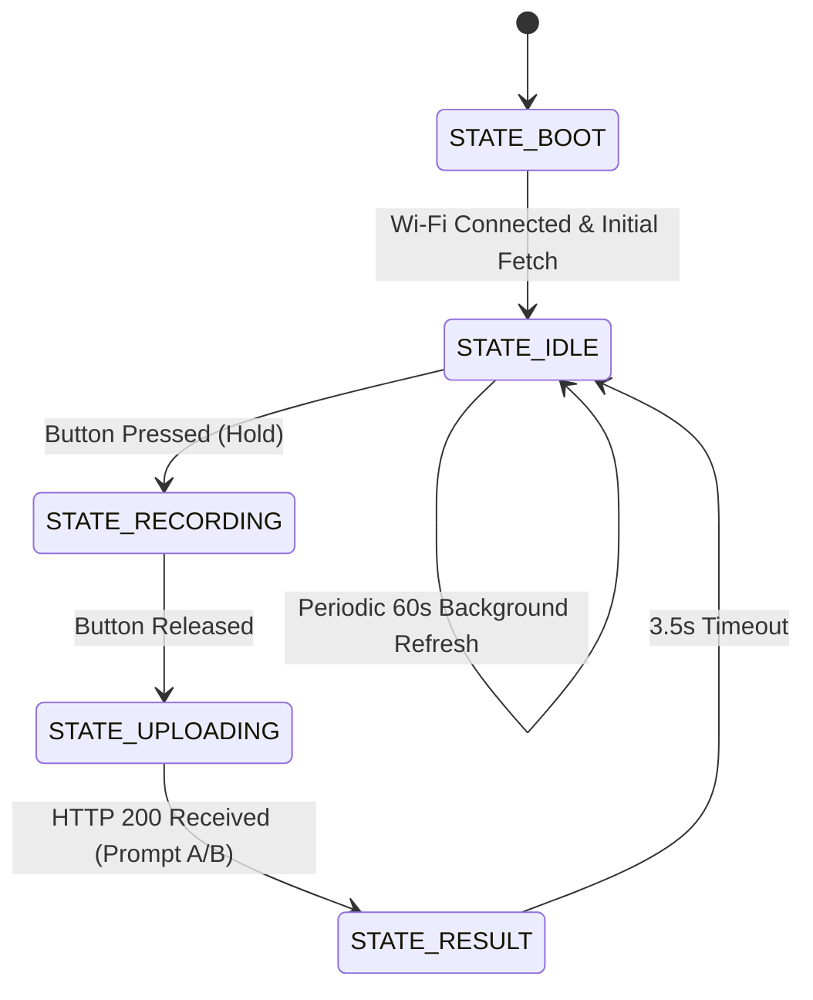

# CoachPilot AI — Waveshare ESP32-S3 Mini Hardware Product Design & Engineering Specification

This document contains the complete engineering specification for building the **CoachPilot AI Physical Desk Companion** using the **Waveshare ESP32-S3 Mini Development Board, Based on ESP32-S3FH4R2 Dual-Core Processor, 240MHz Running Frequency, 2.4GHz Wi-Fi & Bluetooth 5**, paired with an **INMP441 I2S digital microphone** and a **128x64 I2C OLED display**.

---

## 1. Product Architecture Overview

```
 ┌─────────────────────────────────────────────────────────────────┐
 │       PHYSICAL DESK COMPANION (WAVESHARE ESP32-S3 MINI)         │
 │                                                                 │
 │  ┌────────────────┐   ┌────────────────┐   ┌─────────────────┐  │
 │  │ 0.96" I2C OLED │   │ INMP441 I2S Mic│   │ TS1215CJ Tactile│  │
 │  │  (128x64 Pix)  │   │  (16kHz/16-bit)│   │ Push-To-Talk BTN│  │
 │  └───────▲────────┘   └───────▲────────┘   └────────▲────────┘  │
 │          │ (I2C)              │ (I2S DMA)           │ (GPIO)    │
 │  ┌───────┴────────────────────┴─────────────────────┴─────────┐ │
 │  │ Waveshare ESP32-S3 Mini (ESP32-S3FH4R2 240MHz Dual-Core)   │ │
 │  │ 4MB Flash + 2MB On-Chip Quad-SPI PSRAM (R2)                │ │
 │  └────────────────────────────┬───────────────────────────────┘ │
 └───────────────────────────────┼─────────────────────────────────┘
                                 │ Wi-Fi (HTTPS REST / JSON)
                                 ▼
 ┌─────────────────────────────────────────────────────────────────┐
 │       24/7 CLOUD-HOSTED BACKEND (No Laptop Needed)              │
 │                                                         │
 │  ┌──────────────────┐  ┌─────────────────────────────────────┐  │
 │  │  FastAPI Backend │  │   Supabase / SQLite DB              │  │
 │  └────────▲─────────┘  └──────────────▲──────────────────────┘  │
 │           │                           │                         │
 │  ┌────────┴─────────┐  ┌──────────────┴──────────────────────┐  │
 │  │ Whisper STT API  │  │ Google / Apple Calendar API         │  │
 │  │ Gemini / GPT-4o  │  │ (Bi-directional Sync)               │  │
 │  └──────────────────┘  └─────────────────────────────────────┘  │
 └─────────────────────────────────────────────────────────────────┘
```

---

## 2. Bill of Materials (BOM)

| Item | Component | Specification | Estimated Cost |
| :--- | :--- | :--- | :--- |
| **MCU** | **Waveshare ESP32-S3 Mini Development Board** | Based on **ESP32-S3FH4R2** Dual-Core Processor, 240MHz Running Frequency, 2.4GHz Wi-Fi & Bluetooth 5 (4MB Flash, 2MB on-chip PSRAM) | \$4.00 – \$5.50 |
| **Display** | **0.96" or 1.3" I2C OLED Display** | SSD1306 or SH1106 driver, 128x64 resolution, 3.3V | \$2.00 – \$3.00 |
| **Microphone** | **INMP441 I2S Omnidirectional Mic** | 24-bit digital output, SNR 61 dBA, low-noise bottom port | \$1.20 – \$2.00 |
| **Button** | **TS1215CJ 12x12mm Tactile Push Switch** | 250gf actuation force, 15mm height, 100,000 cycles | \$0.20 |
| **Resistor** | **220Ω 1/4W Carbon/Metal Film Resistor** | In-series current limiter for external Status LED | \$0.05 |
| **LED Indicator** | **3mm / 5mm Diffused Blue or Red LED** | External Recording Indicator (or use onboard WS2812 RGB on GPIO 21) | \$0.10 |
| **Power Supply** | **USB-C Cable & 5V/1A Wall Adapter** | Continuous desk power (or 3.7V LiPo battery) | \$2.00 |
| **Total BOM** | | | **\$9.45 – \$12.55** |

---

## 3. Electrical Circuit Schematic & Pin Assignment

```
   ┌────────────────────────────────────────────────────────────┐
   │         WAVESHARE ESP32-S3 MINI (ESP32-S3FH4R2)            │
   │                                                            │
   │   [3V3]   ────────────┬─────────────┬────────────────┐     │
   │   [GND]   ─────────┐  │ (3.3V)      │ (3.3V)         │     │
   │                    │  │             │                │     │
   │   [GPIO 8]  ───────┼──┼── SDA       │                │     │
   │   [GPIO 9]  ───────┼──┼── SCL       │                │     │
   │                    │  │  (OLED)     │                │     │
   │                    │  │             │                │     │
   │   [GPIO 3]  ───────┼──┼─────────────┼── SCK (Clock)  │     │
   │   [GPIO 2]  ───────┼──┼─────────────┼── WS (LRCLK)   │     │
   │   [GPIO 1]  ───────┼──┼─────────────┼── SD (Data)    │     │
   │                    │  │             │  (INMP441)     │     │
   │                    │  └─────────────┴── VDD          │     │
   │                    └──┬─────────────┬── GND / L/R    │     │
   │                       │             │                │     │
   │   [GPIO 6]  ──────────┼── Push BTN ─┘                │     │
   │   [GPIO 10] ──[220Ω]──┼── Status LED ────────────────┘     │
   │   [GPIO 21] ──────────┴── Built-in WS2812 RGB LED (Onboard)│
   └────────────────────────────────────────────────────────────┘
```

### Complete Pin Assignment Table

| Module / Component | Pin / Terminal | Connects To (Waveshare ESP32-S3 Mini) | Logic / Electrical Level | Description & Wiring Details |
| :--- | :--- | :--- | :--- | :--- |
| **SSD1306 OLED (128x64)** | **VCC** | **3V3** | 3.3V DC | Display logic & power supply |
| | **GND** | **GND** | 0V | Common circuit ground |
| | **SDA** | **GPIO 8** | 3.3V I2C Data | Hardware I2C Serial Data line |
| | **SCL** | **GPIO 9** | 3.3V I2C Clock | Hardware I2C Serial Clock line |
| **INMP441 I2S Mic** | **VDD** | **3V3** | 3.3V DC | Digital mic power |
| | **GND** | **GND** | 0V | Common circuit ground |
| | **L/R** | **GND** | 0V (GND) | Left Audio Channel Select |
| | **SD** | **GPIO 1** | 3.3V I2S Data | I2S Serial Data Out (to ESP32) |
| | **WS** | **GPIO 2** | 3.3V I2S Clock | Word Select / LR Frame Clock |
| | **SCK** | **GPIO 3** | 3.3V I2S Clock | Bit Clock Line |
| **TS1215CJ Push Button** | **Pin 1 (or 2)** | **GPIO 6** | Active LOW | Push-to-Talk input (internal `INPUT_PULLUP`) |
| | **Pin 4 (or 3)** | **GND** | 0V | Connects to Ground (closes on press) |
| **220Ω Resistor** | **Lead 1** | **GPIO 10** | 3.3V Output | In-series current-limiting resistor for LED |
| | **Lead 2** | **Status LED Anode (+)** | Forward Current | Connects directly to positive leg of LED |
| **Status LED (External)** | **Anode (+)** | **220Ω Resistor Lead 2** | Current limited | Longer leg of external LED |
| | **Cathode (-)**| **GND** | 0V | Shorter leg of external LED to Ground |
| **WS2812 RGB (Onboard)** | **Data In** | **GPIO 21 (Internal)** | 3.3V Logic | Built-in RGB on Waveshare board (no resistor needed) |

---

## 4. Firmware State Machine & OLED Display Layouts

The firmware operates on an asynchronous 5-state machine:



### 128x64 OLED Screen Pixel Layouts

#### Screen 1: Idle Dashboard (Daily Morning Synthesis)
```
+--------------------------------+
| Mon Sep 01          LIGHT [35%]|  <- Date & Density Level
|--------------------------------|
| [ 35% ]  Mtgs: 2               |  <- Density Box + Meeting count
| [LOAD ]  Step 1 (Micro):       |
|          Draft 3 value prop... |  <- Step 1 Micro-Ignition Task
|--------------------------------|
| GREEN DAY: Launch ideas!       |  <- Executive Coaching Ticker
+--------------------------------+
```

#### Screen 2: Recording State (Push-to-Talk Held)
```
+--------------------------------+
|        >> RECORDING <<         |
|                                |
|     |||| | | |||||| | |||      |  <- Live Dynamic VU Waveform
|                                |
|    Speak thought / idea...     |
+--------------------------------+
```

#### Screen 3: AI Processing & Coaching Result
```
+--------------------------------+
| STATUS: IDEA (88% Feasible)    |
|--------------------------------|
| Starter Action:                |
| Draft 3 value propositions     |
|--------------------------------|
| Feasibility: 88%               |
+--------------------------------+
```

---

## 5. Free 24/7 Cloud Backend Deployment (No Laptop Needed)

Deploying the FastAPI backend to the cloud ensures your Waveshare ESP32-S3 Mini desk companion works anywhere with zero laptop dependency:

### Deploy to Render.com in 3 Minutes:
1. Push this repository to **GitHub**.
2. Log in to [Render.com](https://render.com/) and click **New + $\rightarrow$ Web Service**.
3. Select your repository (`anaswarramesh/my_buddy`).
4. Set the following:
   - **Environment:** `Python`
   - **Build Command:** `pip install -r backend/requirements.txt`
   - **Start Command:** `uvicorn app.main:app --host 0.0.0.0 --port $PORT`
5. Add Environment Variables:
   - `GEMINI_API_KEY`: `your_gemini_api_key` (or `OPENAI_API_KEY`)
   - `LLM_PROVIDER`: `gemini` (or `openai`)
6. Copy your public URL (e.g. `https://coachpilot-backend.onrender.com`).
7. Paste this URL into `SERVER_BASE` in [`CoachPilot_ESP32.ino`](CoachPilot_ESP32.ino).

---

## 6. 3D Enclosure Mechanical Design Guidelines

For a commercial-grade 3D printed desk companion:
1. **Front Bezel:** Rectangular cutout of $27.0\text{ mm} \times 14.5\text{ mm}$ for flush mounting the 0.96" OLED display.
2. **Microphone Sound Port:** Drill a $1.5\text{ mm}$ hole directly aligned with the INMP441 bottom sound port, with a 1mm acoustic foam gasket to prevent internal chassis reverberation.
3. **Button Placement:** The TS1215CJ tactile switch has a 15mm stem height, which protrudes cleanly through a 2.5mm top housing without requiring extra plunger extenders.
4. **Angled Stand:** $35^\circ$ tilted wedge design for optimal desk viewing angle.
