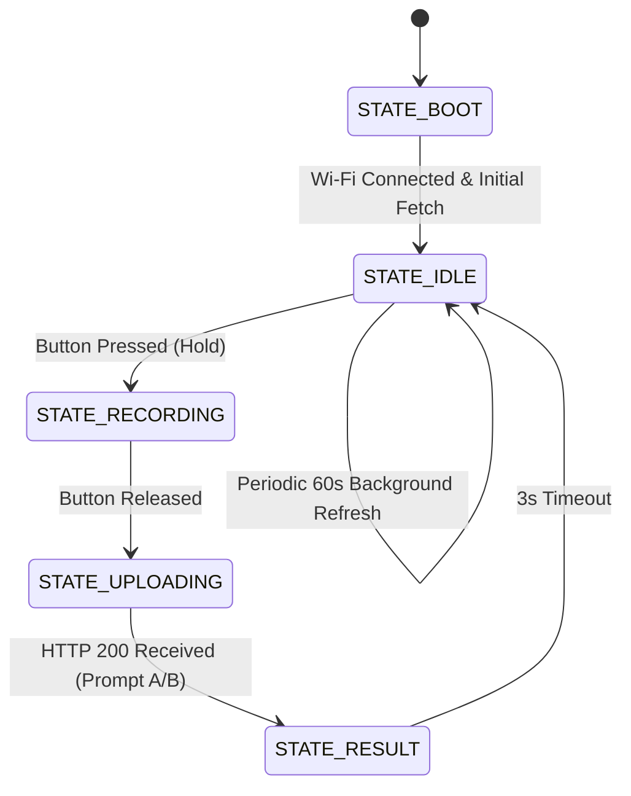

# CoachPilot AI — ESP32 Hardware Product Design & Engineering Specification

This document contains the complete engineering specification for building the **CoachPilot AI Physical Desk Companion** using the **ESP32** microcontroller, **I2S digital microphone**, and **128x64 OLED display**.

---

## 1. Product Architecture Overview

```
 ┌─────────────────────────────────────────────────────────┐
 │               PHYSICAL DESK COMPANION (ESP32)           │
 │                                                         │
 │  ┌────────────────┐   ┌────────────────┐   ┌─────────┐  │
 │  │ 0.96" I2C OLED │   │ INMP441 I2S Mic│   │ Push-To-│  │
 │  │  (128x64 Pix)  │   │  (16kHz/16-bit)│   │  Talk   │  │
 │  └───────▲────────┘   └───────▲────────┘   └───▲─────┘  │
 │          │ (I2C)              │ (I2S DMA)      │ (GPIO) │
 │  ┌───────┴────────────────────┴────────────────┴──────┐ │
 │  │             ESP32-S3 / ESP32-WROOM-32              │ │
 │  └────────────────────────────┬───────────────────────┘ │
 └───────────────────────────────┼─────────────────────────┘
                                 │ Wi-Fi (HTTPS REST / JSON)
                                 ▼
 ┌─────────────────────────────────────────────────────────┐
 │       CLOUD-HOSTED BACKEND (Render / Fly.io / AWS)      │
 │                                                         │
 │  ┌──────────────────┐  ┌─────────────────────────────┐  │
 │  │  FastAPI Backend │  │   Supabase / SQLite DB      │  │
 │  └────────▲─────────┘  └──────────────▲──────────────┘  │
 │           │                           │                 │
 │  ┌────────┴─────────┐  ┌──────────────┴──────────────┐  │
 │  │ Whisper STT API  │  │ Google / Apple Calendar API │  │
 │  │ Gemini / GPT-4o  │  │ (Bi-directional Sync)       │  │
 │  └──────────────────┘  └─────────────────────────────┘  │
 └─────────────────────────────────────────────────────────┘
```

---

## 2. Bill of Materials (BOM)

| Item | Component | Specification | Estimated Cost |
| :--- | :--- | :--- | :--- |
| **MCU** | **ESP32-S3-DevKitC-1** (or ESP32-WROOM-32) | Dual-core 240MHz, 8MB Flash, 512KB SRAM, Wi-Fi/BLE | \$3.50 – \$5.00 |
| **Display** | **0.96" or 1.3" I2C OLED Display** | SSD1306 or SH1106 driver, 128x64 resolution, 3.3V | \$2.00 – \$3.50 |
| **Microphone** | **INMP441 I2S Omnidirectional Mic** | 24-bit digital output, SNR 61 dBA, low-noise bottom port | \$1.20 – \$2.00 |
| **Button** | **6x6mm or 12x12mm Tactile Push Button** | Momentary push switch (Push-to-Talk) | \$0.20 |
| **LED Indicator** | **3mm / 5mm Diffused Blue or RGB LED** | Recording / Processing status indicator | \$0.10 |
| **Resistor** | **220Ω 1/4W Resistor** | Current-limiting resistor for Status LED | \$0.05 |
| **Power (Option 1)** | **USB-C Cable & 5V/1A Wall Adapter** | Standard USB-C desk power | \$2.00 |
| **Power (Option 2)** | **TP4056 Charging Board + 3.7V 800mAh LiPo** | For portable rechargeable battery operation | \$3.50 |
| **Total BOM** | | | **\$9.00 – \$14.00** |

---

## 3. Electrical Circuit Schematic & Pin Assignment

```
   ┌────────────────────────────────────────────────────────┐
   │                       ESP32 PINOUT                     │
   │                                                        │
   │   [3.3V]  ────────────┬─────────────┬────────────┐     │
   │   [GND]   ─────────┐  │ (3.3V)      │ (3.3V)     │     │
   │                    │  │             │            │     │
   │   [GPIO 21] ───────┼──┼── SDA       │            │     │
   │   [GPIO 22] ───────┼──┼── SCL       │            │     │
   │                    │  │  (OLED)     │            │     │
   │                    │  │             │            │     │
   │   [GPIO 33] ───────┼──┼─────────────┼── SCK      │     │
   │   [GPIO 25] ───────┼──┼─────────────┼── WS       │     │
   │   [GPIO 32] ───────┼──┼─────────────┼── SD       │     │
   │                    │  │             │  (INMP441) │     │
   │                    │  └─────────────┴── VDD      │     │
   │                    └──┬─────────────┬── GND/L/R  │     │
   │                       │             │            │     │
   │   [GPIO 4]  ──────────┼── Push BTN ─┘            │     │
   │   [GPIO 2]  ──[220Ω]──┼── Status LED ────────────┘     │
   └───────────────────────┴────────────────────────────────┘
```

### Complete Pin Assignment Table

| Module | Pin Name | ESP32 Pin | Logic Level | Description |
| :--- | :--- | :--- | :--- | :--- |
| **SSD1306 OLED** | **VCC** | **3V3** | 3.3V | Display Power |
| | **GND** | **GND** | 0V | Ground |
| | **SDA** | **GPIO 21** | 3.3V I2C Data | Hardware I2C SDA |
| | **SCL** | **GPIO 22** | 3.3V I2C Clock | Hardware I2C SCL |
| **INMP441 Mic** | **VDD** | **3V3** | 3.3V | Digital Mic Power |
| | **GND** | **GND** | 0V | Ground |
| | **L/R** | **GND** | 0V | Left Audio Channel Select |
| | **SD** | **GPIO 32** | 3.3V I2S Data | I2S Serial Data Line |
| | **WS** | **GPIO 25** | 3.3V I2S Clock | Word Select / Frame Clock |
| | **SCK** | **GPIO 33** | 3.3V I2S Clock | Bit Clock Line |
| **Push Button** | **Pin 1** | **GPIO 4** | Active LOW | Input Pull-up Button |
| | **Pin 2** | **GND** | 0V | Ground |
| **Status LED** | **Anode (+)** | **GPIO 2** | 3.3V (220Ω) | HIGH when recording |
| | **Cathode (-)**| **GND** | 0V | Ground |

---

## 4. Firmware State Machine & OLED Display Layouts

The firmware operates on a robust 5-state asynchronous state machine:



### 128x64 OLED Screen Pixel Layouts

#### Screen 1: Idle Dashboard (Daily Synthesis)
```
+--------------------------------+
| Mon Sep 01          LIGHT [35%]|  <- Date & Density Level
|--------------------------------|
| [ 35% ]  Mtgs: 2               |  <- Density Box + Meeting count
| [LOAD ]  Task:                 |
|          Draft 3 value prop... |  <- Step 1 Micro-Ignition Task
|--------------------------------|
| GREEN DAY: Launch ideas!       |  <- Executive Coaching Ticker
+--------------------------------+
```

#### Screen 2: Recording State (Push-to-Talk Held)
```
+--------------------------------+
|        >> RECORDING <<         |
|                                |
|     |||| | | |||||| | |||      |  <- Live Animated VU Waveform
|                                |
|    Speak your idea or task...  |
+--------------------------------+
```

#### Screen 3: AI Processing & Coaching Verdict
```
+--------------------------------+
| STATUS: IDEA (88% Feasible)    |
|--------------------------------|
| Verdict: Validated demand.     |
| Step 1: Draft 3 value props    |
| Est Time: 15 mins (Micro)      |
+--------------------------------+
```

---

## 5. Free 24/7 Cloud Backend Deployment (No Laptop Needed)

Deploying the FastAPI backend to the cloud ensures your ESP32 desk companion works anywhere with zero laptop dependency:

### Deploy to Render.com in 3 Minutes:
1. Push this repository to **GitHub**.
2. Log in to [Render.com](https://render.com/) and click **New + $\rightarrow$ Web Service**.
3. Select your repository.
4. Set the following:
   - **Environment:** `Python`
   - **Build Command:** `pip install -r coach-pilot/backend/requirements.txt`
   - **Start Command:** `uvicorn app.main:app --host 0.0.0.0 --port $PORT`
5. Add Environment Variables:
   - `OPENAI_API_KEY`: `your_openai_key` (or `GEMINI_API_KEY`)
   - `LLM_PROVIDER`: `gemini` (or `openai`)
6. Copy your public URL (e.g. `https://coachpilot-backend.onrender.com`).
7. Paste this URL into `SERVER_BASE` in [`CoachPilot_ESP32.ino`](file:///Users/anaswarrameshp/.gemini/antigravity/scratch/coach-pilot/hardware/esp32/CoachPilot_ESP32.ino).

---

## 6. 3D Enclosure Mechanical Design Guidelines

For a commercial-grade 3D printed desk enclosure:
1. **Front Bezel:** Rectangular cutout of $27.0\text{ mm} \times 14.5\text{ mm}$ for flush mounting the 0.96" OLED display.
2. **Microphone Acoustic Sound Port:** Drill a $1.5\text{ mm}$ hole directly aligned with the INMP441 bottom sound port, with a 1mm acoustic foam gasket to prevent internal chassis reverberation.
3. **Button Placement:** Large $10\text{ mm}$ top-mounted tactile actuation cap for ergonomic "press-to-talk" execution while sitting at your desk.
4. **Angled Stand:** $35^\circ$ tilted wedge design for optimal desk viewing angle.
